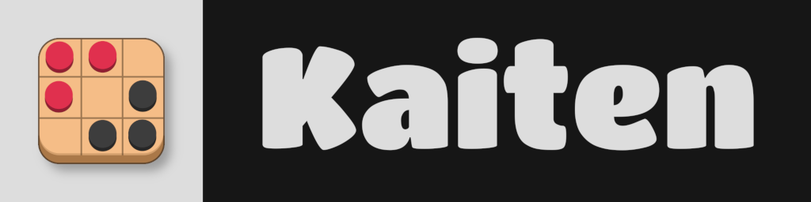

  
   
  <a href="#about">About </a>•
  <!-- <a href="#features">Features </a>•
  <a href="#supported-types">Types </a>•
  <a href="#example-code">Examples </a>•
  <a href="#building--using">Building & Using </a>• -->
  <a href="#license">License</a>

## About
Rust implementation of Kaiten, an abstract strategy game that I designed.

## License
Kaiten uses the [BSD-Z Software License](https://colleen05.me/bsd-z.html), which is a custom license combining 2-clause BSD and Zlib.